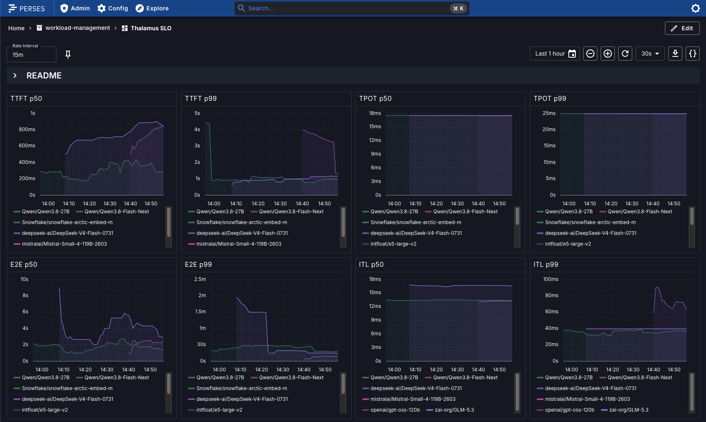

# Perses Dashboards <VerifiedBadge page="perses-dashboards" />

Thalamus ships a set of [Perses](https://perses.dev) dashboards in
[`examples/perses-dashboards`](https://github.com/cobaltcore-dev/thalamus/tree/@@DOCS_VERSION@@/examples/perses-dashboards):

| Dashboard             | Purpose                                                                             |
|-----------------------|-------------------------------------------------------------------------------------|
| `thalamus-slo.json`   | User-facing latency SLOs (TTFT, TPOT, E2E, ITL), queue depth, endpoints             |
| `thalamus-usage.json` | Token volume and request parameters                                                 |
| `thalamus-gpu.json`   | GPU utilization, memory, and health via DCGM **(only with GPU operator installed)** |
| `thalamus-vllm.json`  | Engine-level debugging: scheduling, prefill/decode, KV cache                        |
| `thalamus-llmd.json`  | Router (EPP) debugging: queueing, prefix routing, payload sizes                     |



_The SLO dashboard: user-facing latency per model (TTFT, TPOT, E2E, ITL),
queue depth, and endpoint availability._

## Prerequisites

- Prometheus,
  e.g. through [kube-prometheus-stack](https://github.com/prometheus-community/helm-charts/tree/main/charts/kube-prometheus-stack),
  which also provides [kube-state-metrics](https://github.com/kubernetes/kube-state-metrics)
  (required for some panels).
- [Perses](https://perses.dev/helm-charts/docs/installation/) with a Prometheus datasource pointing at your Prometheus.

## Install Prometheus and Perses

Install
[kube-prometheus-stack](https://github.com/prometheus-community/helm-charts/tree/main/charts/kube-prometheus-stack)
as the `monitoring` release:

```bash test
helm install monitoring oci://ghcr.io/prometheus-community/charts/kube-prometheus-stack \
  --version 88.6.2 \
  --namespace monitoring --create-namespace \
  --set grafana.enabled=false \
  --set alertmanager.enabled=false \
  --set nodeExporter.enabled=false \
  --set prometheus.prometheusSpec.retention=2h \
  --wait --timeout=600s
```

Then install Perses into its own namespace:

```bash test
helm repo add perses https://perses.github.io/helm-charts
helm repo update perses
helm install perses perses/perses \
  --version 0.22.0 \
  --namespace perses --create-namespace \
  --wait --timeout=600s
kubectl wait deployment --all --namespace perses \
  --for=condition=Available --timeout=300s
```

## Enable metric scraping

The `thalamus` chart creates `ServiceMonitor`/`PodMonitor` resources for the
operator, the vLLM engine, and the endpoint picker, and the bundled
`agentgateway` chart creates monitors for the gateway controller and its
proxies. Enable both with values passed to the `thalamus` release:

Make sure `release` field matches the namespace where you have deployed Prometheus.

```yaml test:monitoring.yaml
# monitoring.yaml
monitoring:
  enabled: true
  additionalLabels:
    release: monitoring
agentgateway:
  monitoring:
    enabled: true
    serviceMonitor:
      extraLabels:
        release: monitoring
```

```bash test
helm upgrade --install thalamus oci://ghcr.io/cobaltcore-dev/charts/thalamus \
  --namespace thalamus --wait --reuse-values \
  --version @@CHART_VERSION@@ \
  -f monitoring.yaml
```

Verify the monitors exist and carry the Prometheus release label:

```bash test
kubectl get servicemonitor thalamus-operator thalamus-epp --namespace thalamus -o json | grep -q '"release": "monitoring"'
kubectl get podmonitor thalamus-engine --namespace thalamus -o json | grep -q '"release": "monitoring"'
```

## Load the dashboards

You can add all the dashboards manually:

1. Run `kubectl port-forward -n <perses-namespace> svc/perses 9090:8080` depending on your Perses installation and go to
   `localhost:9090` or the respective port.
2. Create the project named `thalamus`.
3. For each dashboard in
   `examples/perses-dashboards`, click "Add dashboard", specity name, click "Edit JSON" button with **"{}"
   ** symbol, copy and paste the full dashboard code.
4. Save.

Alternatively, use [percli](https://github.com/perses/perses/blob/main/docs/cli.md) CLI
to apply the project and dashboards to your Perses instance automatically:

```bash test
GOBIN="$HOME/.local/bin" go install "github.com/perses/perses/cmd/percli@v0.53.1"
export PATH="$HOME/.local/bin:$PATH"
```

Then log in and apply the project and dashboards:

```bash test
percli login "$PERSES_URL"
percli apply -f "$REPO_ROOT/examples/perses-dashboards/project.json"
for d in "$REPO_ROOT"/examples/perses-dashboards/thalamus-*.json; do
  percli apply -f "$d"
done
```

Verify scraping and the dashboards through the APIs (Perses renders
client-side, so assert on the REST API plus a live Prometheus query, not on
page HTML). Export `PERSES_URL` (e.g. `http://localhost:9090` after the
port-forward above) and `PROM_URL` (your Prometheus, e.g.
`http://localhost:9091`) first:

```bash test
curl -s "$PROM_URL/api/v1/targets?state=active" | grep -q thalamus-operator
curl -s "$PERSES_URL/api/v1/projects/thalamus" | grep -q thalamus
for d in thalamus_slo thalamus_usage thalamus_gpu thalamus_vllm thalamus_llmd; do
  curl -sf "$PERSES_URL/api/v1/projects/thalamus/dashboards/$d" | grep -q "$d"
done
```

Then add a Prometheus datasource to the `thalamus` project (Data
Sources tab) and open the project in the Perses UI.

- Type name and scrape interval (recommended 15s)
- Select "Proxy" in **HTTP Settings
  ** and write the respective in-cluster Prometheus service address, depending on your installation (for the upstream Prometheus chart with default installation into
  `monitoring` namespace it is `http://monitoring-kube-prometheus-prometheus.monitoring.svc.cluster.local:9090`)
