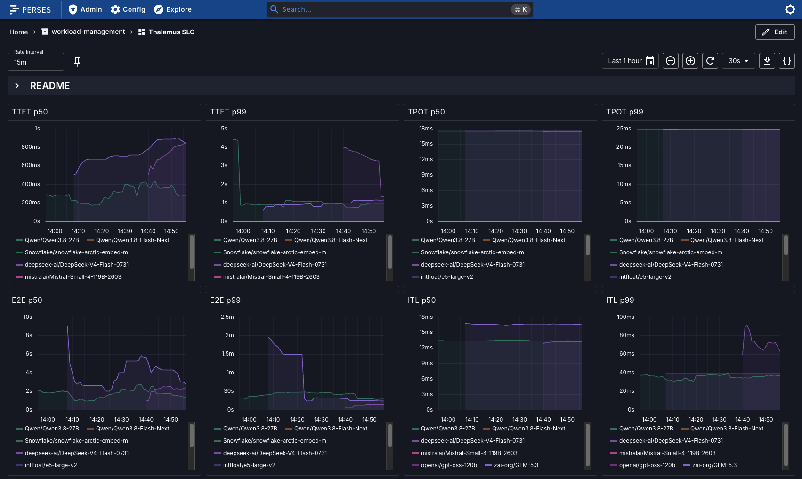

# Perses Dashboards

Thalamus ships a set of [Perses](https://perses.dev) dashboards in
[`examples/perses-dashboards`](https://github.com/cobaltcore-dev/thalamus/tree/@@DOCS_VERSION@@/examples/perses-dashboards):

| Dashboard | Purpose |
| --- | --- |
| `thalamus-slo.json` | User-facing latency SLOs (TTFT, TPOT, E2E, ITL), queue depth, endpoints |
| `thalamus-usage.json` | Token volume, request parameters, per-tenant compute consumption |
| `thalamus-gpu.json` | GPU utilization, memory, and health via DCGM |
| `thalamus-vllm.json` | Engine-level debugging: scheduling, prefill/decode, KV cache |
| `thalamus-llmd.json` | Router (EPP) debugging: queueing, prefix routing, payload sizes |



_The SLO dashboard: user-facing latency per model (TTFT, TPOT, E2E, ITL),
queue depth, and endpoint availability._

## Prerequisites

- Prometheus,
  e.g. through [kube-prometheus-stack](https://github.com/prometheus-community/helm-charts/tree/main/charts/kube-prometheus-stack),
  which also provides [kube-state-metrics](https://github.com/kubernetes/kube-state-metrics)
  (required for some panels).
- [Perses](https://perses.dev/helm-charts/docs/installation/) with a Prometheus datasource pointing at your Prometheus.

## Enable metric scraping

The `thalamus` chart creates `ServiceMonitor`/`PodMonitor` resources for the
operator, the vLLM engine, and the endpoint picker, and the `agentgateway`
chart creates one for the gateway, when monitoring is enabled:

```yaml
# my-cluster.yaml (helmfile state values)
thalamus:
  monitoring:
    enabled: true
agentgateway:
  monitoring:
    enabled: true
```

```bash
helmfile --file helm/helmfile.yaml.gotmpl apply --state-values-file my-cluster.yaml
```

> [!NOTE]
> If your Prometheus selects monitors by label (e.g. the `release:` label of
> kube-prometheus-stack), add it via `monitoring.additionalLabels` in the
> `thalamus` chart and `monitoring.serviceMonitor.extraLabels` in the
> `agentgateway` chart.

## Per-tenant token usage (optional)

The **Tenants** panels of the Usage dashboard group token usage by a
`tenant_hash` label. Agent Gateway only attaches that label if you tell it to,
via an `AgentgatewayPolicy` that derives it from the API key of each request.

1. Store each API key as JSON with a `tenant` field in its `metadata` (instead
   of a plain key):

```bash
kubectl create secret generic apikey-my-client \
  --namespace thalamus \
  --from-literal=api-key='{"key": "<your-api-key>", "metadata": {"tenant": "my-client"}}'
kubectl label secret apikey-my-client -n thalamus thalamus-apikey=true
```

2. Extend the API key policy with a `tenant_hash` metric attribute. The
   expression is hash of the tenant name, so Prometheus
   only ever stores an anonymized identifier:

```yaml
apiVersion: agentgateway.dev/v1alpha1
kind: AgentgatewayPolicy
metadata:
  name: apikey-auth
  namespace: thalamus
spec:
  targetRefs:
    - group: gateway.networking.k8s.io
      kind: Gateway
      name: inference-gateway
      sectionName: api
  frontend:
    metrics:
      attributes:
        add:
          - name: tenant_hash
            expression: 'sha256.encode("<your-random-salt>:" + apiKey.tenant).substring(0, 8)'
  traffic:
    apiKeyAuthentication:
      mode: Strict
      secretSelector:
        matchLabels:
          thalamus-apikey: "true"
```

The gateway then attaches `tenant_hash` to all of its metrics providing the data for the Tenant dashboard panels.

## Load the dashboards

Use the [percli](https://github.com/perses/perses/blob/main/docs/cli.md) CLI
to apply the project and dashboards to your Perses instance:

```bash
percli login https://<perses-url>
percli apply -f examples/perses-dashboards/project.json
for d in examples/perses-dashboards/thalamus-*.json; do
  percli apply -f "$d"
done
```

Then add a Prometheus datasource to the `thalamus` project (Settings → Data
Sources) and open the project in the Perses UI.
